# Newcastle Story Game

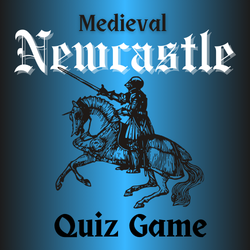

This is a game inspired by Enid Blyton's "famous five" and other 'choose your own adventure' books.

https://en.wikipedia.org/wiki/Choose_Your_Own_Adventure

---

## Rationale
The idea is simple. The user chooses how the story begins and ends with a series of twists and turns along the way. Using various javascript methods to achieve this, 
the game will be fully interactive with buttons and images to be revealed depending on which options are chosen. 

### Extra features
To add sound effects hidden in a loop or even music would be an extra bonus. 

## User stories
#### User Story 1
A tourist company wants to use a story based game to introduce their customers to the city and are keen on utilizing the website to achieve this goal.

#### User Story 2
Many international students visit the city each year to study and work. Various local groups would like to engage this base by having a platform to showcase local culture.

#### User Story 3
A school teacher wants to help the children learn about medieval history and wants a simple to use game to reinforce lessons in the class.

#### User-design/Experience
The website will consist of one page and keep CSS hidden values to achieve this.

## Development 
### Logo design
Here are the various designs of the logo and favicons...
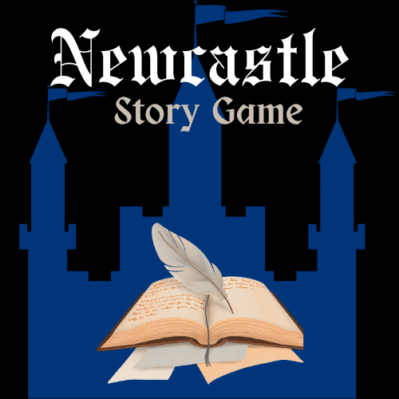
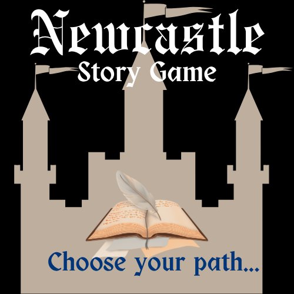
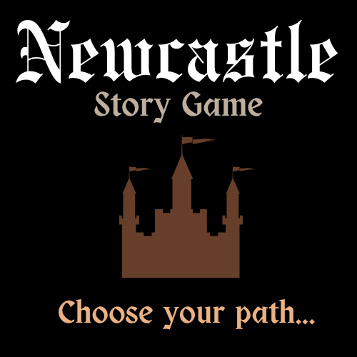
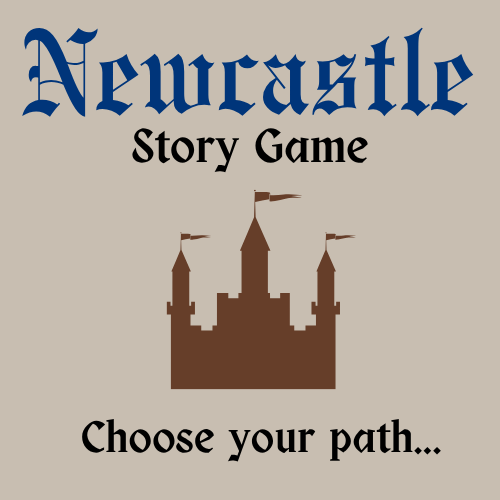
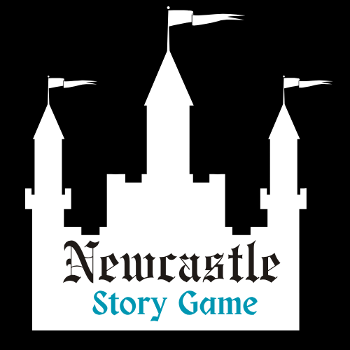
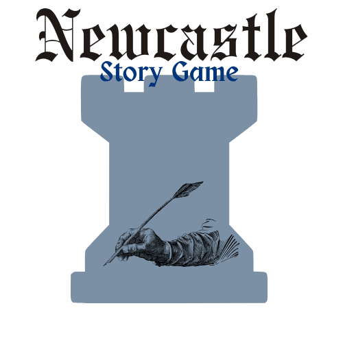
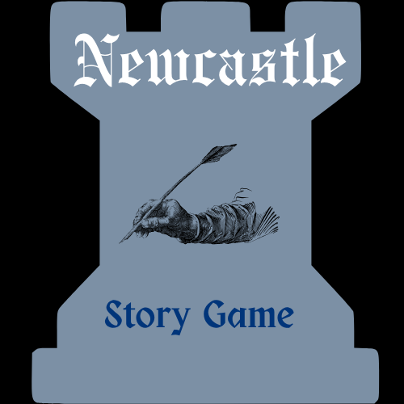
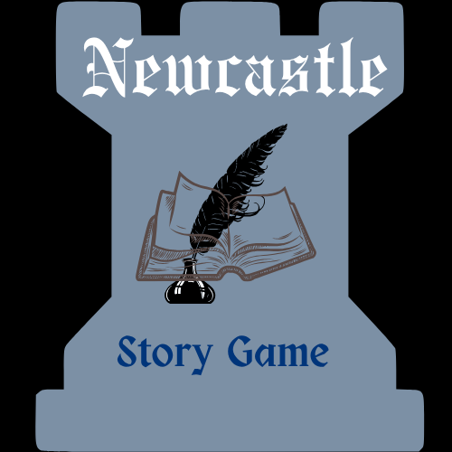
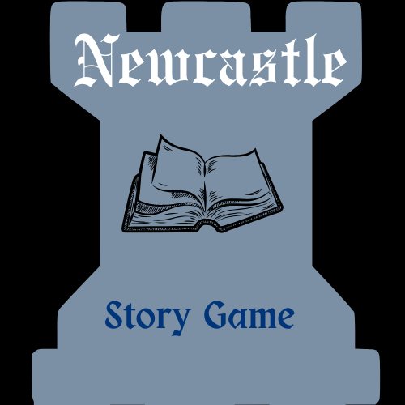
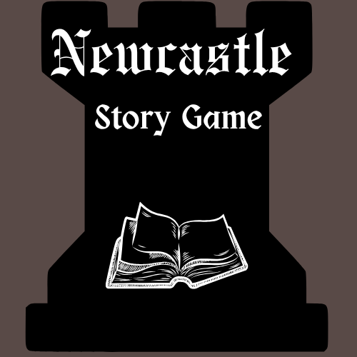
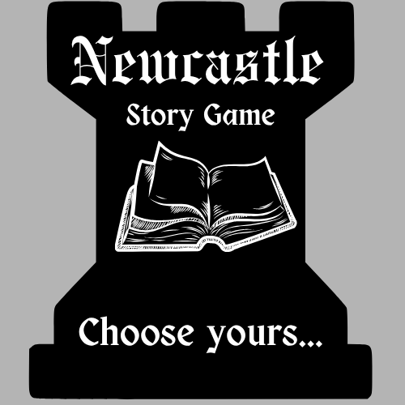
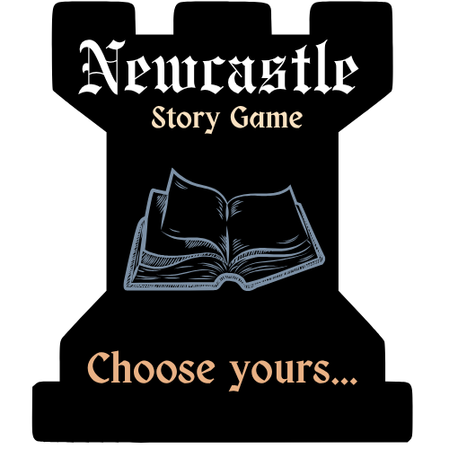
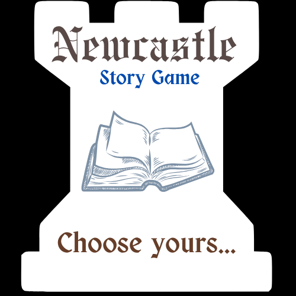
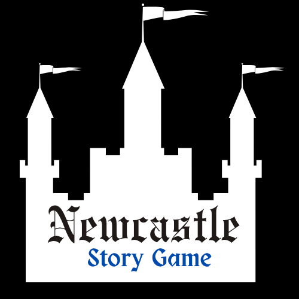
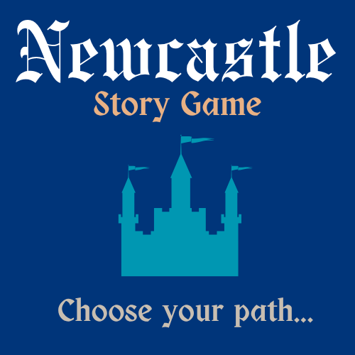
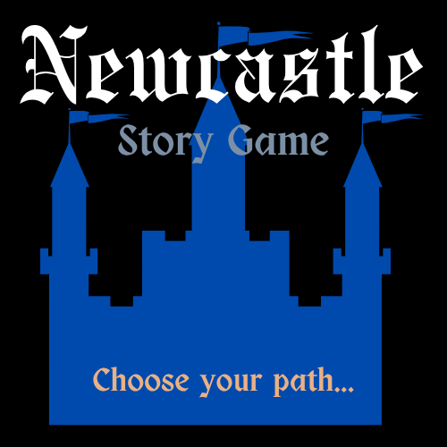
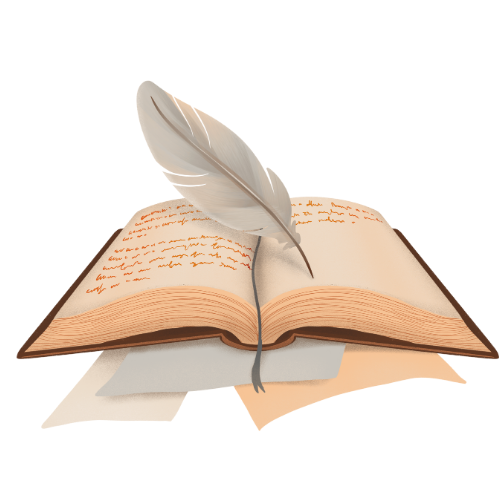
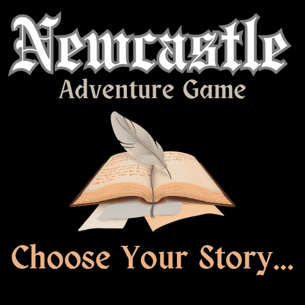
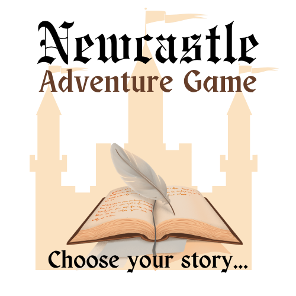

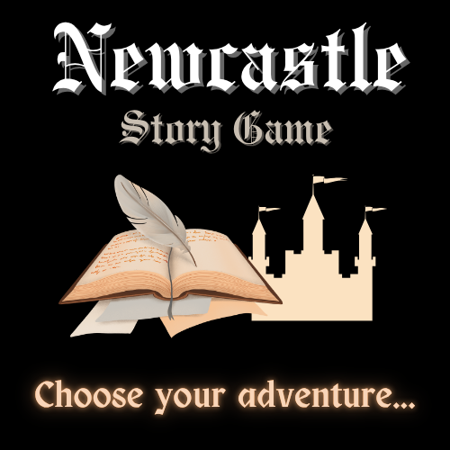
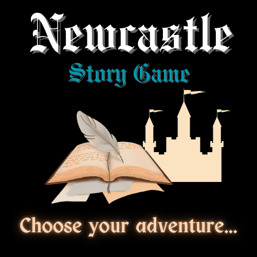
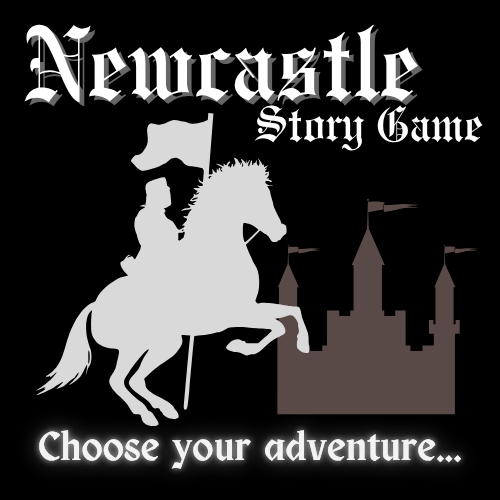
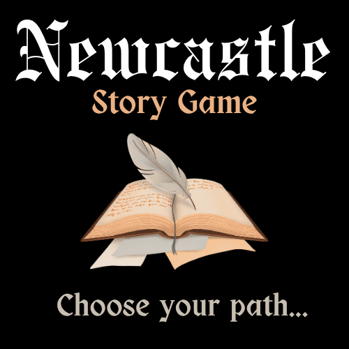

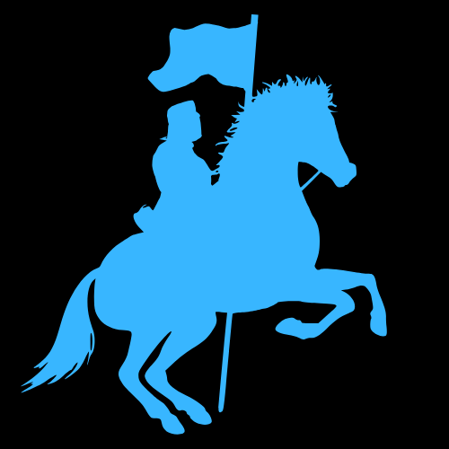
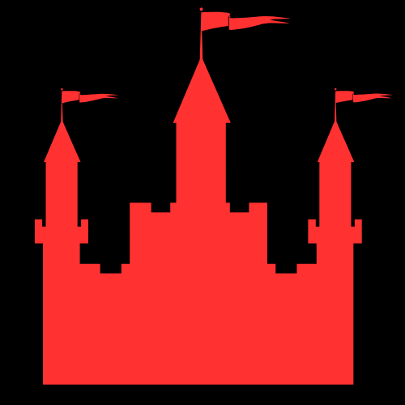

This was the final design and chosen logo...
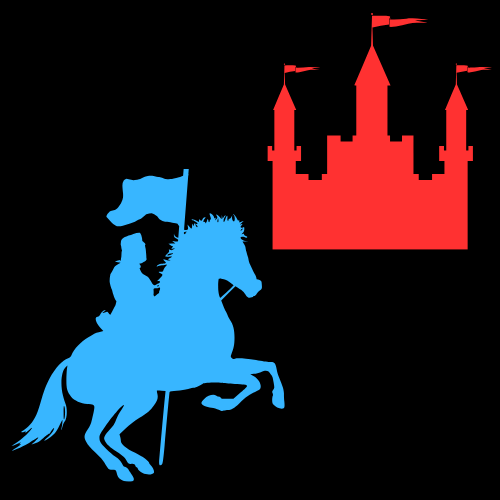
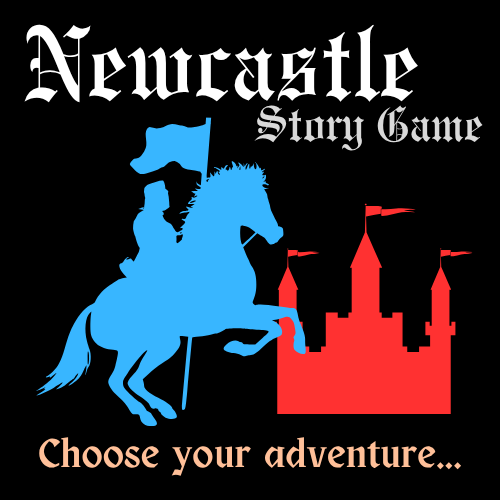
And for the game page the logo is...
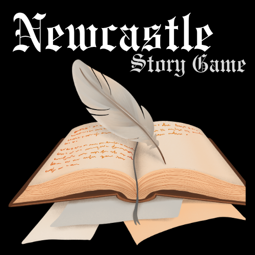

The logic is an interactive story game so an open book invites the user to participate to co-create a story of their own choosing.

### Layout
Fully responsive 
#### Colour Scheme
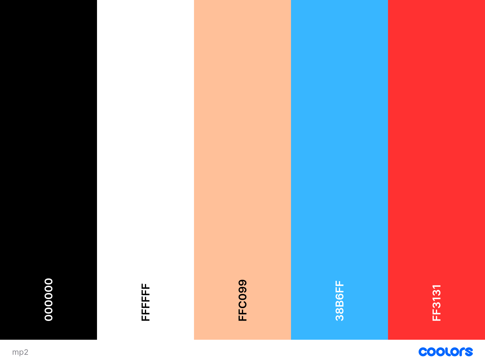

### Fonts
For The logo two were used :
Engravers Old English and Obra letra. Both of these font styles were found within the CANVA platform. 
For the writing and buttons and text, only one 
https://fonts.google.com/selection
Macondo-Regular
This was installed onto my computer so no need to link it in the style sheet or embed code.
images used
background -- 
Image by <a href="https://pixabay.com/users/marcosantiago-5154646/?utm_source=link-attribution&utm_medium=referral&utm_campaign=image&utm_content=2335880">Marco Santiago</a> from <a href="https://pixabay.com//?utm_source=link-attribution&utm_medium=referral&utm_campaign=image&utm_content=2335880">Pixabay</a>Image by Marco Santiago from Pixabay

Image by <a href="https://pixabay.com/users/joelfazhari-16466931/?utm_source=link-attribution&utm_medium=referral&utm_campaign=image&utm_content=6976024">Joel Fazhari</a> from <a href="https://pixabay.com//?utm_source=link-attribution&utm_medium=referral&utm_campaign=image&utm_content=6976024">Pixabay</a>
https://pixabay.com/photos/swords-medieval-blades-historic-6976024/

Image by Joel Fazhari from Pixabay

Image by OpenClipart-Vectors from Pixabay

https://pixabay.com/vectors/armor-armour-horse-horseback-1299032/
Image by <a href="https://pixabay.com/users/openclipart-vectors-30363/?utm_source=link-attribution&utm_medium=referral&utm_campaign=image&utm_content=1299032">OpenClipart-Vectors</a> from <a href="https://pixabay.com//?utm_source=link-attribution&utm_medium=referral&utm_campaign=image&utm_content=1299032">Pixabay</a>

### Animations/gifs
GIF by <a href="https://pixabay.com/users/julientromeur-3630051/?utm_source=link-attribution&utm_medium=referral&utm_campaign=animation&utm_content=629">Julien Tromeur</a> from <a href="https://pixabay.com//?utm_source=link-attribution&utm_medium=referral&utm_campaign=animation&utm_content=629">Pixabay</a>

### Sizing the buttons 
The buttons I wanted to be icons to make it more fun for the user. There was an issue with trying to make them responsive on smaller screens. Fortunately, flex-wrap was the perfect answer to this issue. 

The buttons themselves are actally emojis... 

<ul>
<li>A Castle</li>
<li>Thumbs up</li>
<li>Thumbs down</li>
<li>Horse/ Carousel</li>
<li>A Crown</li>
</ul>

## The Plot/Storyline
### Brave Knight saves king from certain death

Using historical and local landmarks and culture to allow the user to navigate and learn facts about the city as they go. 

They begin by choosing their speech, their small army and their choice of weapons. The player then has to choose how long they want to play for. The duration is set by using the buttons provided near the bottom of the screen.

A reset button has been provided to bring them back to the start or if they finish the game/or prefer to play it differently. 

I decided to include a button to allow the user to go one step back, so as to not make them go right back to the start and save time. This should keep them playing for longer. 

### Acceditations/refrences/citations
https://www.newcastlecastle.co.uk/

Emojis/buttons 

https://emojipedia.org/

