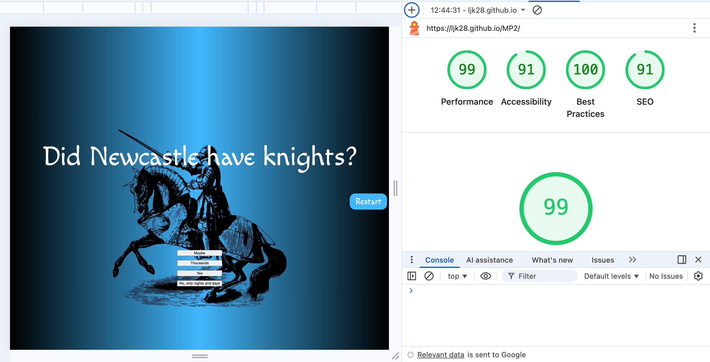
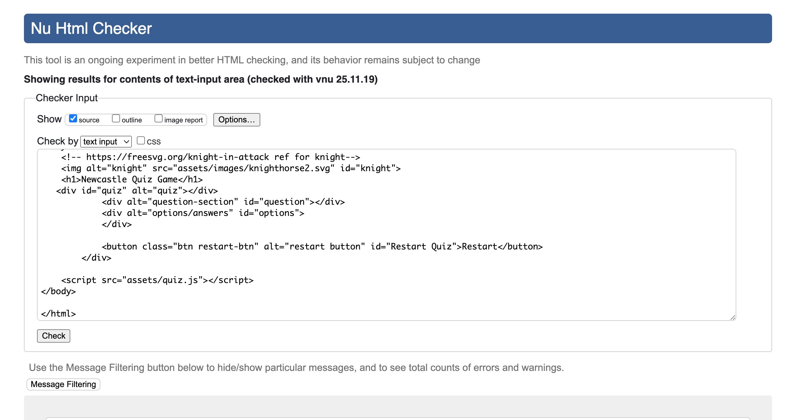
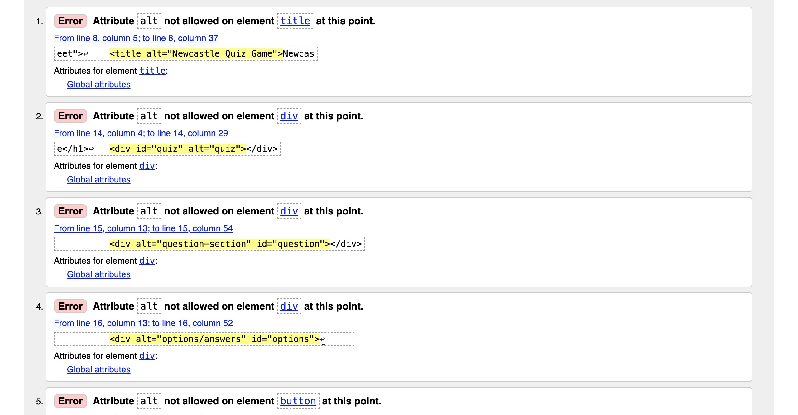
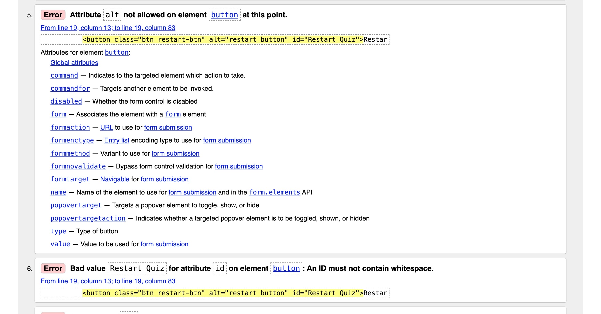
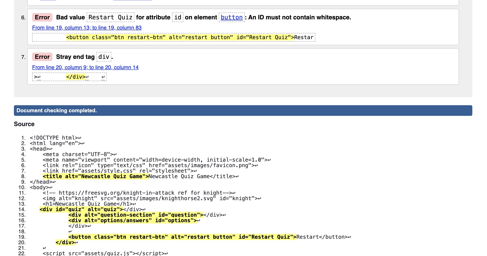
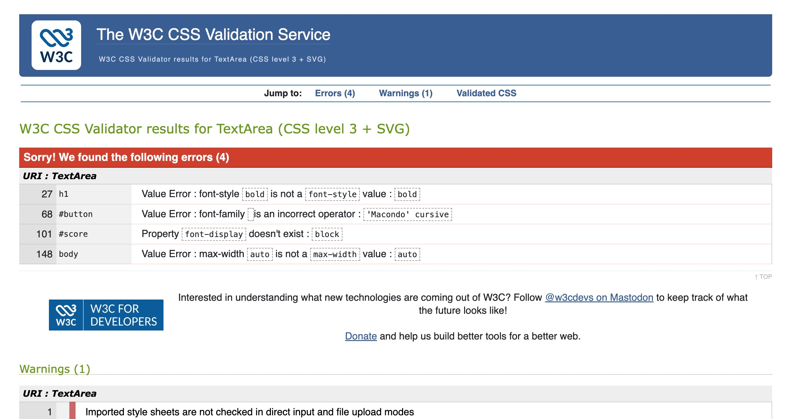
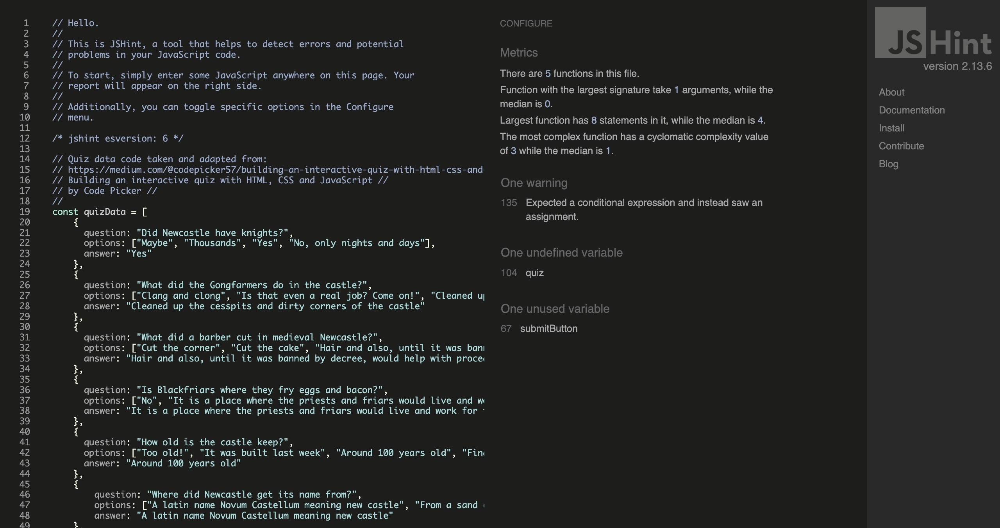
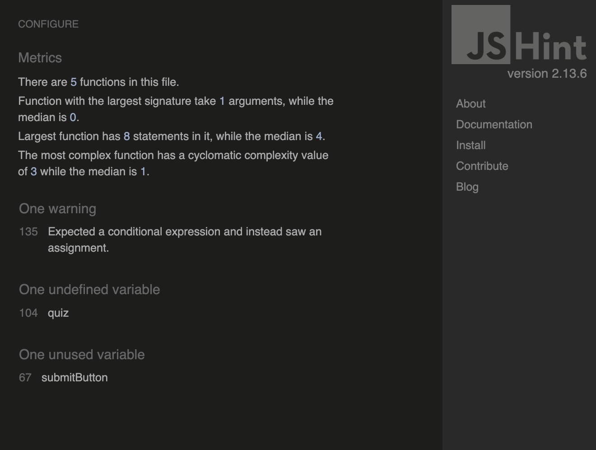

## Newcastle Castle Quiz Game

## Rationale
A simple quiz game to help tourists, teachers and anyone else to traverse the medieval history of Newcastle upon Tyne.

The quiz tests the users local medieval knowledge.
Seeing how much the tourists actualy remember, or the students whilst on a day trip outside of the classroom.

Albeit, this could have been about a more recent history of the city but I decided the fun part to focus on, was the medieval era. I have regularly walked past part of old Newcastle on my way to work many times.

The quiz game is a great way to help engage users learning and capacity to retain information. This is short term memory feedback for the teachers to check if their students are actually paying attention or not. 

## User Stories 
#### User Story 1
A local tourist company would like an engaging app/website for their customers to enjoy and learn about medieval north-east England history. Nothing too long or difficult but enough to test the knowledge at the end of the tour with a prize draw for the most correct answers. 
#### User Story 2
A school is currently covering medieval history in their curriculum and would like to use the website to help students revise for the upcoming exam. Special knight status with a certificate and badge will be awarded to the highest score.

#### User Story 3
A local family is tracing their family tree/roots and has managed to find their  medieval roots are firmly in the local area. They want to hold a fun quiz night for friends and extended family and the website is a perfect way to get everyone to play along. Knights at the round table and fancy costume dress is being encouraged. 

### Favicon 
The design of the favicon was simple. Black and white, with a silhouette. 

This is because even though the main page is blue and black, Newcastle is famous for their (Toon army)-Football club nickname which has black and white stripes. Newcastle upon Tyne also traded in in coal, which is black. Along with booming wool production and exporting (which is grayish white).

## Bugs and Development 
The project has took many twists and turns along the way. It was orginally a story game but this was a little too complex and convoluted to keep it going. Thus, the choice was made to abandon the text adventure for a more simple quiz game about the city instead. This was meant to be easier to write code and easier to maintain and alter at a later stage. 

The evolution of this project has been frought wth difficulties. I had to get rid of the previous code for the JS and find a new way to implement the quiz. 

As the code seemingly didn't work and didn't move onto the next question, I had to check the specific code that was a problem. Unfortnately, the bugs or bug still perisisted and I had to use a different way to implement the quiz.  

Finding a new tutorial with the code in place and then customising it. 
The original did have true and false boolean options after the array of questions but this was simplified after finding a new quiz online with code and tutorial that simply used the correct answer input instead. 

## Design and Layout

### Wireframes and mock ups

### Mock-ups

Please Note:The actual game has no instructions as seen in the wireframes and this part was not reflected in the final design.

### Aria labels

The logo, title and divs for the quiz, answers/options section and the restart button have a label for aria accessibility. 

### Lighthouse results...

After adding a restart button to the quiz I re-ran the Lighthouse tests and the result was for both mobile and desktop over 90 plus on each count. 

For the desktop the results were very pleasing but not the same for the mobile version. 
### Jigsaw and W3 validator for HTML and CSS...

Now with the new code in place and a revised and updated quiz...

I fixed the incorrect alt label to aria-label

### Javascript validator

After altering and adding the new code I ran the test again via jsvalidator and got these results...

### JShint

Here are the results from JShint:

## References/citations

## Styling of button
https://uiverse.io/buttons
https://uiverse.io/Spacious74/horrible-horse-4

The orginal quiz was sourced from WEB DEV SIMPLIFIED 
"Build A Quiz App With JavaScript"
https://www.youtube.com/watch?v=riDzcEQbX6k

and the source code is here:
https://github.com/WebDevSimplified/JavaScript-Quiz-App

After failing to spot the bugs and the reason why it didn't work I decided to abandon this tutorial and found a new one instead...

The new source code and quiz tutorial is:

https://www.youtube.com/watch?v=gn0OaxS1OdY 
https://medium.com/@codepicker57/building-an-interactive-quiz-with-html-css-and-javascript-efe9bd8129e2
// Building an interactive quiz with HTML, CSS and JavaScript //
// by Code Picker //

https://www.historic-uk.com/HistoryMagazine/DestinationsUK/NewcastleuponTyne/

https://www.chroniclelive.co.uk/news/history/newcastles-gallowgate-strawberry-fields-public-10079019#:~:text=Newcastle%20West%20End%20played%20there,3Comments

https://www.newcastlecastle.co.uk/

https://blackfriarsrestaurant.co.uk/blackfriars-history/

https://www.newcastle.gov.uk/our-city/history-and-heritage

https://castellogy.com/history/medieval-money

https://www.wilcuma.org.uk/the-history-of-northumberland-after-1066/medieval-newcastle/

https://co-curate.ncl.ac.uk/history-of-st-andrews-church-newcastle/

https://www.historic-uk.com/HistoryMagazine/DestinationsUK/NewcastleuponTyne/

Aria ref
https://developer.mozilla.org/en-US/docs/Web/Accessibility/ARIA/Reference/Attributes/aria-label

### Tools used 
<ul>
<li>Canva</li>
<li>Figma</li>
<li>Jshint</li> 
<li>VS Code</li>
<li>CSS</li>
<li>Jigsaw/W3 Validator</li>
<li>javascript-validator</li>
 ---
 New additions below---
<li>Jquery</li>
<li>Emojidb.org</li>

https://www.site24x7.com/tools

<li>Apple notes for Mac</li>
<li>Freesvg</li>
<li>MDN Docs</li>

https://freesvg.org/

## Tutorials 

"Build A Quiz App With JavaScript"
https://www.youtube.com/watch?v=riDzcEQbX6k&t=1419s 
CSS 
https://www.tutorialrepublic.com/faq/css-background-opacity-without-effecting-the-child-elements.php 
"HTML & CSS for Absolute Beginners: Responsive images"

// the following code for the restart button is taken and adapted from: geekforgeeks.org
// https://www.geeksforgeeks.org/how-to-add-restart-button-in-javascript-quiz-app/
// How to add Restart Button in JavaScript Quiz App
// By GeeksforGeeks

/// Note the above link (geeks for geeks) is broken BUT left in for integrity purposes - unable to source the orginal link-perhaps its now no longer there-I don't know.///
// And also from:
// Restart button code taken and adapted from Emmet suggestions and:
// https://www.youtube.com/watch?v=zZRX51xcIAg
// "Building an Interactive Quiz App with JavaScript"
// By 
// Netcreed

### Using slide down/up/toggle function  
https://www.w3schools.com/jquery/tryit.asp?filename=tryjquery_slide_down

# Using the Jquery Library
To use the library I used the latest CDN in the head tag in the html page and 
https://releases.jquery.com/

https://css-plus.com/2010/03/6-steps-to-take-if-your-jquery-is-not-working/

#### Adding emojis...
https://emojidb.org/medieval-emojis?utm_source=user_search

Adding links to new pages using js in html pages...
https://www.geeksforgeeks.org/html/how-to-link-a-button-to-another-page-in-html/
 
CSS placement of title
https://www.shecodes.io/athena/462387-how-to-move-the-title-closer-to-the-top-of-a-page-using-css#:~:text=To%20move%20your%20title%20closer,adjust%20the%20top%20property%20accordingly.&text=Make%20sure%20to%20replace%20.,title%20element%20in%20your%20HTML.

CSS article for REM, EM and PX...
https://joshcollinsworth.com/blog/never-use-px-for-font-size

Code for buttons and JS code taken and adapted (along with Emmet suggestions)...
https://www.youtube.com/watch?v=zZRX51xcIAg
"Building an Interactive Quiz App with JavaScript"
By 
Netcreed

// Thank you for reading this read me // 

