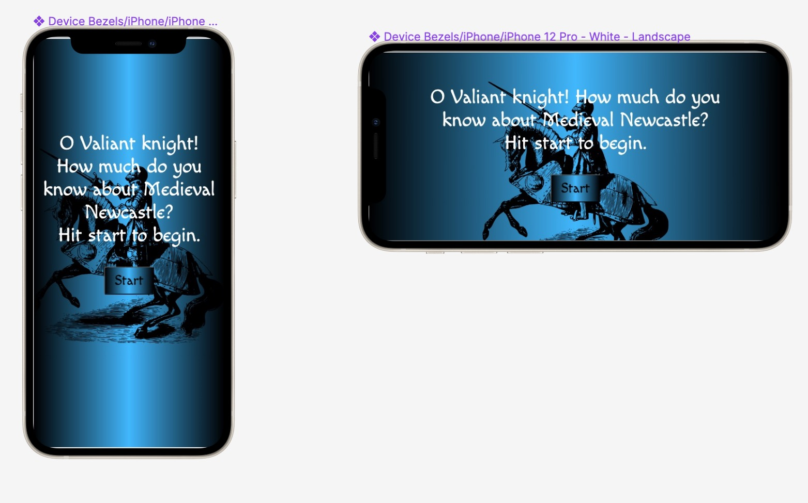
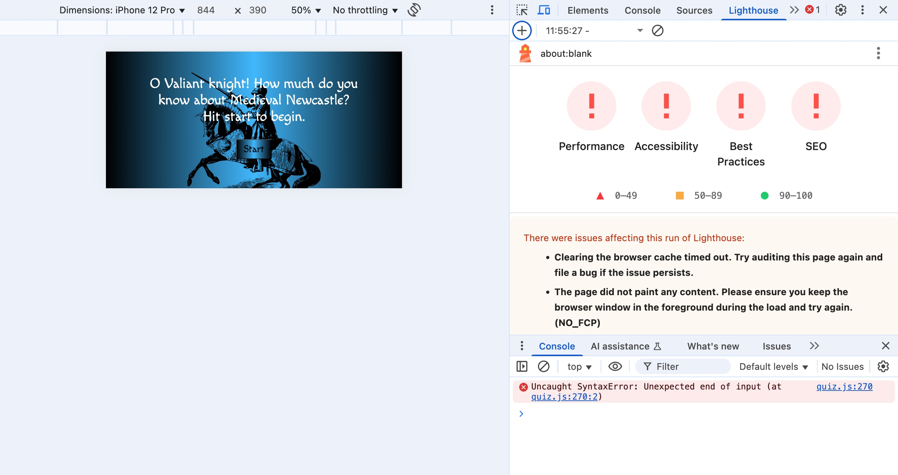
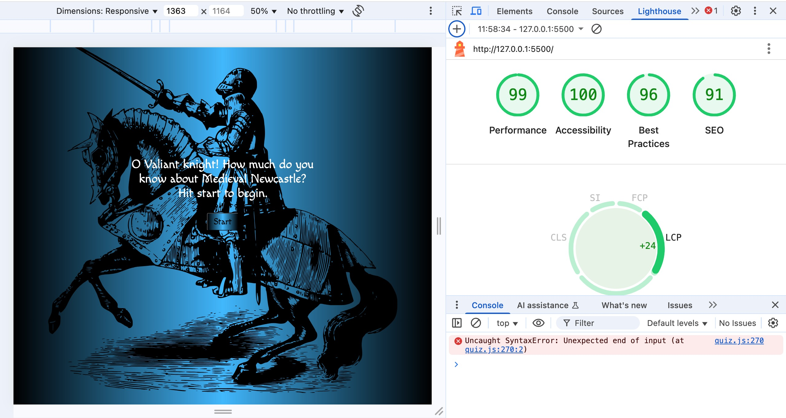

## Newcastle Castle Quiz Game

### Introduction 
A simple quiz game to help tourists, teachers and and anyone else to traverse the medieval history of Newcastle upon Tyne.
## Rationale
The idea behind the original was to showcase and tell in story form the history of medieval Newcastle. The quiz has took over and made it about testing the knowledge of users instead. 
Seeing how much the tourists actualy remember, or the students whilst on a day trip outside of the classroom.

Albeit, this could have been about a more recent history of the city but I decided the fun part to focus on was the medieval era.

The quiz game is a great way to help in gaging the users learning and capacity to retain information.

## User Stories 
#### User Story 1
A local tourist company would like an engaging app/website for their customers to enjoy and learn about medieval northeast England history. Nothing too long or difficult but enough to test the knowledge at the end of the tour with a prize draw for the most correct answers. 
#### User Story 2
A school is currently covering medieval history in their curriculum and would like to use the website to help students revise for the upcoming exam.

#### User Story 3
A local family is tracing their family tree and has managed to find their  medieval roots are firmly in the area. They want to hold a fun quiz night for friends and extended family and the website is a perfect way to get everyone to play along.

### Favicon 
The design of the favicon was simple. Black and white, with a silhouette. 

This is because even though the main page is blue and black, Newcastle is famous for their (Toon army)-Football club nickname which has black and white stripes. Newcastle upon Tyne also traded in in coal, which is black. Along with booming wool production and exporting (which is greyish white).

## Bugs and Development 
The project has took many twists and turns along the way. It was orginally a story game but this was a little too complex and convoluted to keep it going. Thus, th choice was made to abandon the text adventure for a more simple quiz game about the city instead. This was meant to be easier to write the code and easier to maintain and alter at a later stage. 

### Wireframes and mock ups

### Mock-ups

### Lighthouse results...

For the desktop the rsults were very pleasing but not the same for the mobile version. 