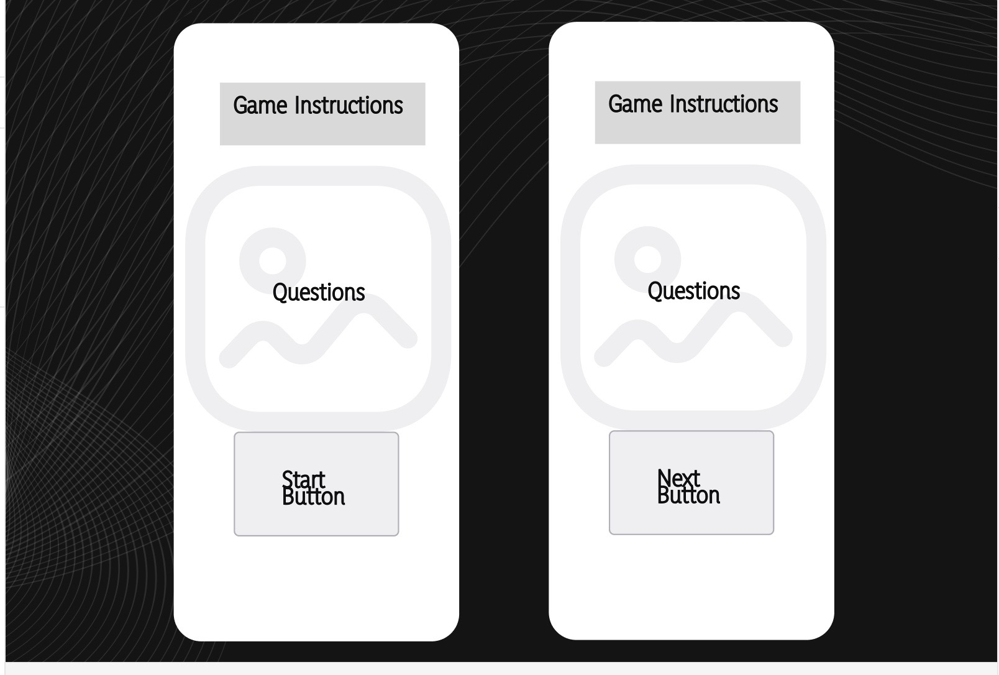
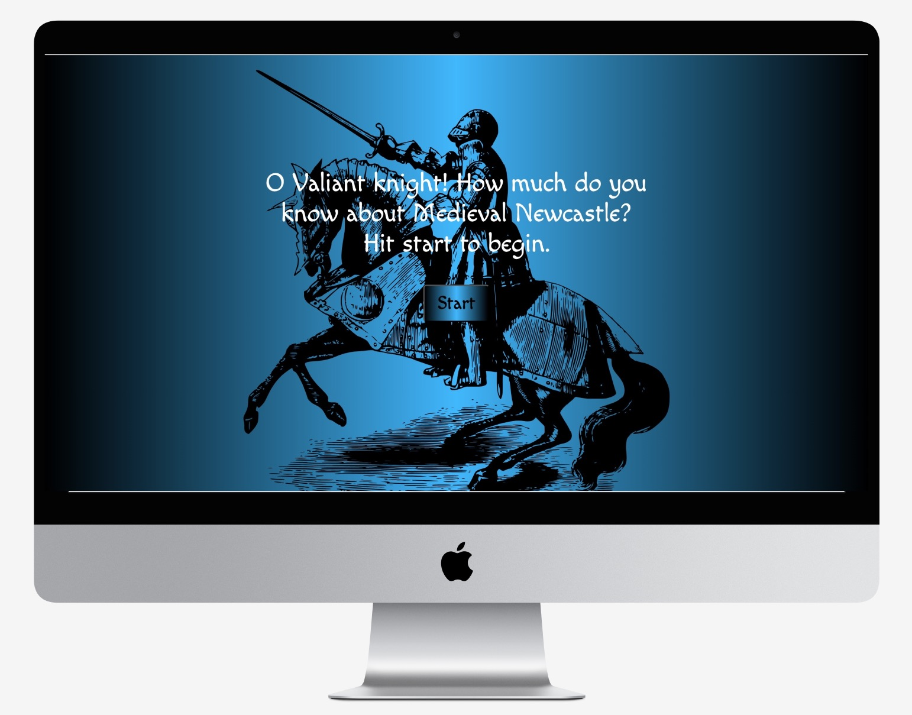
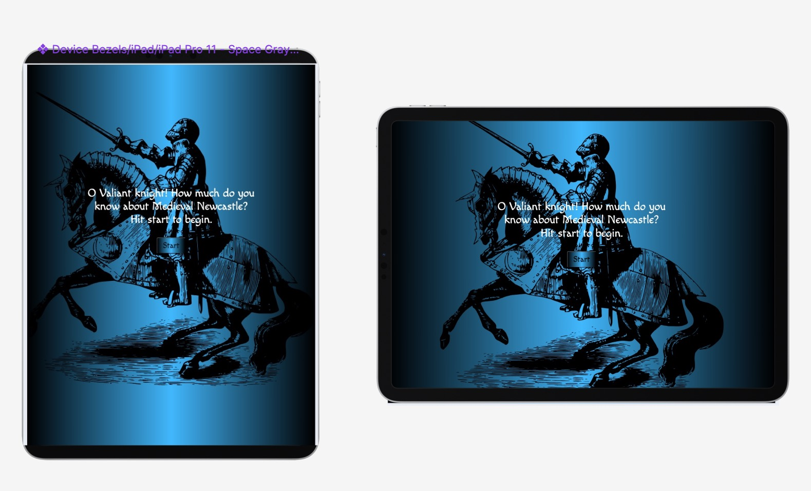

## Newcastle Castle Quiz Game

### Introduction 
A simple quiz game to help tourists, teachers and and anyone else to traverse the medieval history of Newcastle upon Tyne.
## Rationale
## User Stories 
#### User Story 1
A local tourist company would like an enaging app/website for their customers to enjoy and lern about medieval history. Nothing too long or difficult but enough to test the knowledge at the end of the tour with a prize draw for the most correct answers. 
#### User Story 2
A school is currently covering Medieval history in their curriculum and would like to use the website to help students revise for the uocoming exam.

#### User Story 3
A local family is tracing their family tree and has managed to find their roots are firmly in the area with this historcal period the furthest back. They want to hold a fun quiz night for friends and extended family and the website is a perfect way to get everyone to play along.

### Favicon 
The design of the favicon was simple. Black and white with a silhouette. 

This is because even though the mian page is blue and black, Newcastle is famous for , Toon army-Football club nickname whihc is black and white strioes. Trading in coal, which is black. Wool production and exporting (which is greyish white).

## Bugs and Development 
The project has took many twists and turns along the way. Itbwas orginally a story game but this was a little too complex and convoluted to keep it going. Abandonig the stiry based text adventure for a more simple quiz game about the city. This was meant to be easier to write the code and easier to maintain and alter at a alter date. 

### Wireframes and mock ups

### Mock-ups

