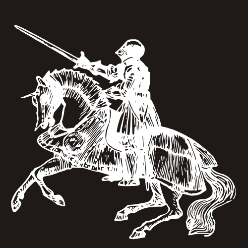

## Newcastle Castle Quiz Game

### Introduction 
A simple quiz game to help tourists, teachers and and anyone else to traverse the medieval history of Newcastle upon Tyne.
## Rationale
The idea behind the original was to showcase and tell in story form the history of medieval Newcastle. The quiz has took over and made it about testing the knowledge of users instead. 
Seeing how much the tourists actualy remember, or the students whilst on a day trip outside of the classroom.

Albeit, this could have been about a more recent history of the city but I decided the fun part to focus on was the medieval era.

The quiz game is a great way to help in engaging the users learning and capacity to retain information.

With a focus on local history, users can test their depth of knowledge with an interative feature as start and next buttons. 

## User Stories 
#### User Story 1
A local tourist company would like an engaging app/website for their customers to enjoy and learn about medieval northeast England history. Nothing too long or difficult but enough to test the knowledge at the end of the tour with a prize draw for the most correct answers. 
#### User Story 2
A school is currently covering medieval history in their curriculum and would like to use the website to help students revise for the upcoming exam.

#### User Story 3
A local family is tracing their family tree and has managed to find their  medieval roots are firmly in the area. They want to hold a fun quiz night for friends and extended family and the website is a perfect way to get everyone to play along.

### Favicon 
The design of the favicon was simple. Black and white, with a silhouette. 

This is because even though the main page is blue and black, Newcastle is famous for their (Toon army)-Football club nickname which has black and white stripes. Newcastle upon Tyne also traded in in coal, which is black. Along with booming wool production and exporting (which is greyish white).

## Bugs and Development 
The project has took many twists and turns along the way. It was orginally a story game but this was a little too complex and convoluted to keep it going. Thus, th choice was made to abandon the text adventure for a more simple quiz game about the city instead. This was meant to be easier to write the code and easier to maintain and alter at a later stage. 

The evolution of this prject has been frought wth difficulties. I had to get rid of the previous code for the JS and find a new way to implement thre quiz. 

As the code seemingly didn't work and didn't move on to the next question I had to check the code that was a problem. Finding a new tutorial with the code in place and then customising it. 

### Wireframes and mock ups

### Mock-ups

### Lighthouse results...

For the desktop the rsults were very pleasing but not the same for the mobile version. 
### Jigsaw and W3 validator for HTML and CSS...

### Javascript validator

## References/citations

https://www.historic-uk.com/HistoryMagazine/DestinationsUK/NewcastleuponTyne/

https://www.chroniclelive.co.uk/news/history/newcastles-gallowgate-strawberry-fields-public-10079019#:~:text=Newcastle%20West%20End%20played%20there,3Comments

https://www.newcastlecastle.co.uk/

https://blackfriarsrestaurant.co.uk/blackfriars-history/

https://www.newcastle.gov.uk/our-city/history-and-heritage

https://castellogy.com/history/medieval-money

https://www.wilcuma.org.uk/the-history-of-northumberland-after-1066/medieval-newcastle/

https://co-curate.ncl.ac.uk/history-of-st-andrews-church-newcastle/

https://www.historic-uk.com/HistoryMagazine/DestinationsUK/NewcastleuponTyne/

### Tools used 
<ul>
<li>Canva</li>
<li>Figma</li>
<li>Jshint</li> 

https://jshint.com/
<li>VS Code</li>
<li>CSS</li>
<li>Jigsaw/W3 Validator</li>
<li>javascript-validator</li>

https://www.site24x7.com/tools

<li>Apple notes for Mac</li>
<li>Freesvg</li>
<li>MDN Docs</li>

https://freesvg.org/

## Tutorials 

"Build A Quiz App With JavaScript"
https://www.youtube.com/watch?v=riDzcEQbX6k&t=1419s 
CSS 
https://www.tutorialrepublic.com/faq/css-background-opacity-without-effecting-the-child-elements.php 
"HTML & CSS for Absolute Beginners: Responsive images"
https://www.youtube.com/watch?v=gn0OaxS1OdY 

Adding links to new pages using js in html pages...
https://www.geeksforgeeks.org/html/how-to-link-a-button-to-another-page-in-html/
 
CSS placement of title
https://www.shecodes.io/athena/462387-how-to-move-the-title-closer-to-the-top-of-a-page-using-css#:~:text=To%20move%20your%20title%20closer,adjust%20the%20top%20property%20accordingly.&text=Make%20sure%20to%20replace%20.,title%20element%20in%20your%20HTML.

CSS article for REM, EM and PX...
https://joshcollinsworth.com/blog/never-use-px-for-font-size

Code for buttons and JS code taken and adapted (along with Emmet suggestions)...
https://www.youtube.com/watch?v=zZRX51xcIAg
"Building an Interactive Quiz App with JavaScript"
By 
Netcreed
